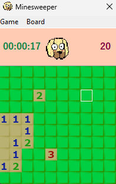

## Minesweeper game

Minesweeper written in Delphi using RAD Studio for the [Ideasawakened challenge](https://ideasawakened.com/post/rad-programmer-challenge-number-1-minesweeper-game-build).

## Features

* Traditional rules: Reveal tiles, or flag them to mark a mine.
* High scores
* Help: Are your flags placed correctly?
* Various board size
* Custom board
* Timer
* Remaining mines
* Watchdog
* Visual twist, all the visuals are made by hand
